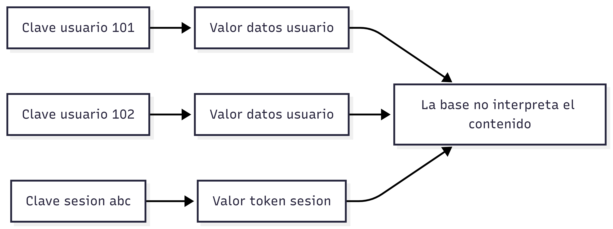

# Bases de datos clave–valor

Este modelo es el más simple dentro del mundo NoSQL.

Los datos se almacenan de forma similar a un diccionario como pares donde una clave única se asocia a un valor.

El sistema no necesita comprender la estructura interna del valor, solo debe almacenarlo y recuperarlo de forma eficiente.

Ventajas:

* Alta velocidad.
* Facilidad de escalabilidad.
* Simplicidad de implementación.

Las operaciones principales consisten en buscar una clave específica. Sin embargo, esta simplicidad también limita las posibilidades de consulta

Desventajas:

* No permite consultas complejas ya que no es posible filtrar por atributos internos del valor.
* No maneja relaciones entre datos.

Las bases de datos clave–valor suelen utilizarse en escenarios donde la rapidez es prioritaria y los datos no requieren análisis complejo

Casos de uso comunes:

* Manejo de sesiones de usuario.
* Sistemas de caché.
* Almacenamiento temporal.
* Aplicaciones que necesitan respuestas en tiempo real.

Ejemplos:

* Redis.
* DynamoDB en modo clave–valor.

