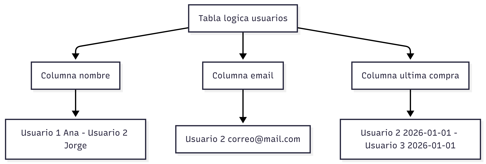

# Bases de datos columnares

En este modelo los datos se organizan en familias de columnas en lugar de filas rígidas.

Esto significa que cada registro puede contener diferentes columnas según sea necesario, lo que proporciona mayor flexibilidad que el modelo relacional tradicional.

Este enfoque es útil cuando se manejan grandes volúmenes de datos que no siempre comparten la misma estructura, que tene casi la misma estructura.

Ventajas:

* Buen rendimiento en grandes escalas.
* Permite optimizar el almacenamiento.
* Mejorar el rendimiento en operaciones de lectura y análisis.
* Adecuadas para análisis de datos.

Desventajas:

* Modelado menos intuitivo, especialmente para quienes provienen del mundo relacional.
* Mayor complejidad de configuración.
* Requieren una planificación cuidadosa para evitar problemas de rendimiento.

Casos de uso comunes:

* Big Data.
* Sistemas de registro de eventos y monitoreo.
* Análisis masivo: aplicaciones que procesan grandes cantidades de información de manera continua.

Ejemplos:

* Cassandra.
* HBase.

