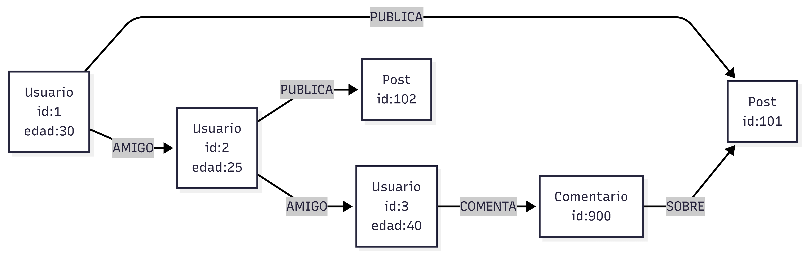

# Bases de datos de grafos

Las bases de datos de grafos están diseñadas para manejar relaciones complejas entre entidades. Utilizan nodos y conexiones para representar los datos.

Este modelo permite explorar relaciones profundas de manera eficiente.

Ventajas:

* Excelente manejo de relaciones
* Consultas complejas eficientes

Desventajas:

* No son ideales para datos tabulares simples
* Requieren cambio de mentalidad en el modelado

Casos de uso comunes:

* Redes sociales
* Sistemas de recomendación
* Detección de fraude

Ejemplos:

* Neo4j.
* Amazon Neptune.
  
  

