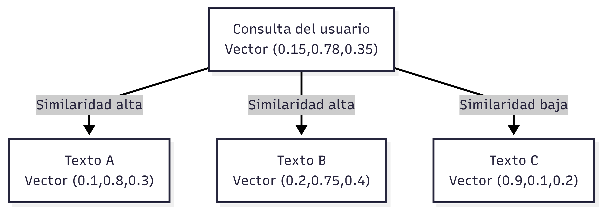

# Bases de datos vectoriales

Las bases de datos vectoriales almacenan información en forma de vectores numéricos que permiten medir similitud entre datos.

Se utilizan principalmente en aplicaciones de inteligencia artificial y búsqueda semántica.

Ventajas:

* Permiten búsquedas por similitud
* Integración con sistemas de IA

Desventajas:

* No reemplazan a bases de datos tradicionales
* Requieren procesamiento previo de datos

Casos de uso comunes:

* Chatbots
* Sistemas de recomendación
* Búsqueda semántica

Ejemplos: FAISS, Pinecone, Weaviate.

